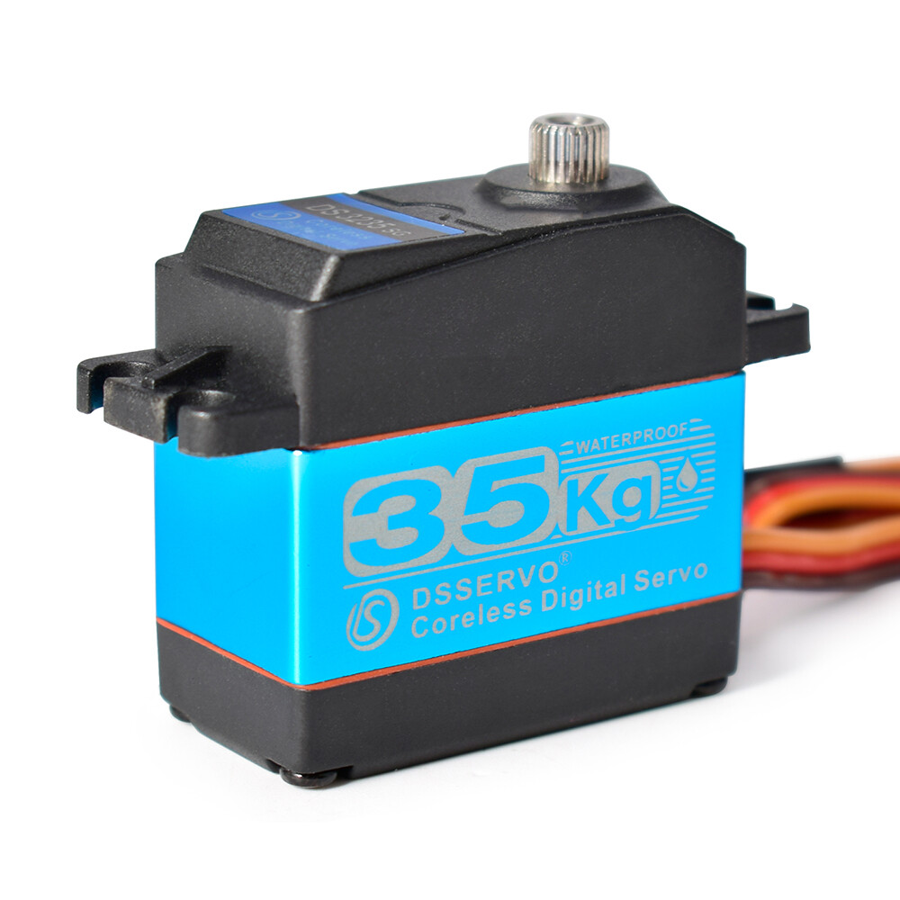
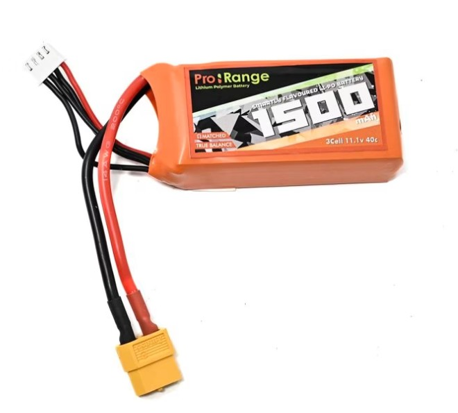

# 🚗 WRO 2025 Future Engineers — Team [YOUR TEAM NAME]

<div align="center">

<!-- Replace with your team banner/logo image -->
<!--  -->

[](https://wro-association.org/)
[](https://python.org)
[](https://opencv.org)
[](https://raspberrypi.org)

</div>

---

> Welcome to the official GitHub repository of **Team [YOUR TEAM NAME]**, competing in the **World Robot Olympiad™ (WRO®) 2025 Future Engineers** category, representing **[YOUR COUNTRY/SCHOOL]**. This repository documents our autonomous self-driving robot — from mechanical design and custom PCB electronics to multiprocessing software and computer vision.

---

## 📚 Table of Contents

- [👥 The Team](#-the-team)
- [🎯 Challenge Overview](#-challenge-overview)
- [🤖 Robot Specifications](#-robot-specifications)
- [⚙️ Mobility Management](#️-mobility-management)
  - [Chassis & Structural Design](#chassis--structural-design)
  - [Drive System](#drive-system)
  - [Steering Mechanism](#steering-mechanism)
  - [Wheels & Traction](#wheels--traction)
- [🔌 Power & Sense Management](#-power--sense-management)
  - [Custom PCB](#custom-pcb)
  - [Power Architecture](#power-architecture)
  - [Microcontroller: Raspberry Pi](#microcontroller-raspberry-pi)
  - [Co-Processor: ESP32 / Arduino](#co-processor-esp32--arduino)
  - [Sensors Overview](#sensors-overview)
  - [TFMini LiDAR Sensors](#tfmini-lidar-sensors)
  - [RPLidar (360°)](#rplidar-360)
  - [BNO085 IMU & Color Sensor](#bno085-imu--color-sensor)
  - [Encoder](#encoder)
  - [Wiring Diagram](#wiring-diagram)
- [💻 Software Architecture](#-software-architecture)
  - [Multiprocessing Design](#multiprocessing-design)
  - [Shared Memory Model](#shared-memory-model)
  - [PID Control System](#pid-control-system)
  - [Servo & Motor Control](#servo--motor-control)
- [🚀 Open Challenge](#-open-challenge)
  - [Direction Detection](#direction-detection)
  - [Wall Following & PID Steering](#wall-following--pid-steering)
  - [Turn Logic](#turn-logic)
  - [Stop Condition](#stop-condition)
- [🚧 Obstacle Challenge](#-obstacle-challenge)
  - [OpenCV HSV Color Detection](#opencv-hsv-color-detection)
  - [Frame Smoothing](#frame-smoothing)
  - [Obstacle Avoidance Logic](#obstacle-avoidance-logic)
  - [Encoder-Based Odometry](#encoder-based-odometry)
  - [RPLidar Turn Trigger](#rplidar-turn-trigger)
  - [12-Turn State Machine](#12-turn-state-machine)
  - [Post-Turn Reset Sequence](#post-turn-reset-sequence)
  - [Parking Maneuver](#parking-maneuver)
- [🐞 Problems Encountered](#-problems-encountered)
- [💡 Future Improvements](#-future-improvements)
- [📁 Repository Structure](#-repository-structure)
- [📜 License](#-license)

---

## 👥 The Team

| Name | Role |
|------|------|
| **[Member 1]** | Hardware Design, Electronics, PCB |
| **[Member 2]** | Software, Computer Vision |
| **Coach: [Coach Name]** | Mentor & Guidance |

> *[Add a brief description of your team, school, and journey here.]*

<div align="center">

<!-- Add your team photos here -->
<!-- |  |  | -->

</div>

---

## 🎯 Challenge Overview

The **WRO 2025 Future Engineers** category requires teams to design an autonomous self-driving vehicle that completes two distinct tasks:

### Open Challenge
The robot must complete **3 laps** autonomously around a track with randomized inner wall placements. There are no traffic signs — the robot must detect its direction (clockwise/counterclockwise) from the track markings (orange/blue lines) and maintain consistent lane-keeping throughout.

### Obstacle Challenge
The robot must complete **3 laps** while:
- Detecting **red** traffic signs → pass on the **right**
- Detecting **green** traffic signs → pass on the **left**
- Detecting **pink** walls → navigate to the **parking zone**
- Executing a **parallel parking** maneuver at the end of lap 3

| Challenge | Key Requirement | Our Approach |
|-----------|----------------|-------------|
| Open | 3 laps, randomized walls | IMU heading PID + TFMini wall sensors |
| Obstacle | Traffic signs + parking | OpenCV HSV detection + RPLidar + encoder odometry |

---

## 🤖 Robot Specifications

| Preview | Specification | Details |
|---------|--------------|---------|
|| Main Controller | Raspberry Pi 5 |
|| **Co-Processor** | ESP32 / Arduino (IMU + Encoder data over UART) |
|| **Drive Motor** | DC Brushed Motor (GPIO 12, PWM 55 Hz) |
|| **Steering Servo** | Standard RC Servo (GPIO 8, PWM 50 Hz) |
|| **Distance Sensors** | 4× TFMini LiDAR (front, left, right, back) |
|| **Mapping Sensors** | RPLidar C1 (360°) |
|| **IMU** | BNO085 9-DoF (heading, color sensing) |
|| **Camera** | USB Camera (640×360 @ 120 FPS) |
|| **Custom PCB** | Yes — designed for this robot |
|| **Operating Voltage** | 12 V LiPo (motor) / 5 V (logic) |
| **Communication** | UART 115200 baud (Pi ↔ ESP32), pigpio bitbang (TFMini), serial 460800 (RPLidar) |

<div align="center">

<!-- Add robot photos here -->
<!-- |  |  | -->
<!-- |  |  | -->
<!-- |  |  | -->

</div>

---

## ⚙️ Mobility Management

### Chassis & Structural Design

The chassis is designed to provide a low center of gravity and maximize sensor coverage. Key design goals:
- **Compact footprint** to navigate tight corners on the 3 m × 3 m game field
- **Rigid frame** to prevent sensor vibration from corrupting IMU readings
- **Easy-access panels** for quick battery and wiring changes at competition
- Strategic component placement to balance front/rear weight distribution

*[Insert your chassis photos and 3D model images here]*

### Drive System

The robot uses a **rear-wheel drive (RWD)** configuration powered by a brushed DC motor. Motor control is handled through **pigpio's hardware PWM** at 55 Hz on GPIO 12, with a direction control pin at GPIO 20:

```
Forward:  GPIO 20 = HIGH,  PWM duty = speed%
Reverse:  GPIO 20 = LOW,   PWM duty = speed%
```

A **power smoothing filter** prevents abrupt current spikes and motor stall:
```python
total_power = (power * 0.1) + (prev_power * 0.9)
pwm_h.set_PWM_dutycycle(pwm_pin, int(2.55 * total_power))
```
This 90/10 exponential moving average gives smooth acceleration and deceleration without jerking.

### Steering Mechanism

Steering is controlled by a servo on **GPIO 8** using pigpio's `set_servo_pulsewidth`. The servo maps angles to microsecond pulse widths:

```python
# Servo.py
def setAngle(angle):
    pulse_width = 500 + round(angle * 11.11)  # µs
    pwm.set_servo_pulsewidth(servo_pin, pulse_width)
```

| Pulse Width | Angle | Direction |
|-------------|-------|-----------|
| 500 µs | 0° | Full left |
| 1500 µs | 90° | Straight ahead |
| 2500 µs | 180° | Full right |

PID corrections subtract from or add to 90° center:
```python
servo.setAngle(90 - correction)   # forward steering
servo.setAngle(90 + correction)   # reverse steering (mirrored)
```

### Wheels & Traction

*[Describe your wheel type, diameter, material, and traction optimization here.]*

---

## 🔌 Power & Sense Management

### Custom PCB

We designed a **custom PCB** to eliminate wiring clutter, improve signal integrity, and make the robot competition-ready. The PCB integrates:
- Raspberry Pi GPIO breakout headers
- TFMini sensor headers (4× independent channels)
- UART level shifting for 3.3V ↔ 5V ESP32 communication
- LED driver connections (RGB status indicators)
- Button inputs with hardware pull-up resistors
- Motor driver and servo signal routing

<div align="center">

<!-- Insert your PCB schematic images exported from WRO_SCH.pdf -->
<!--  -->
<!--  -->

</div>

### Power Architecture

```
LiPo 7.4V ──┬── DC Motor (via H-bridge on PCB)
             └── DC-DC 5V Regulator ──┬── Raspberry Pi (5V via GPIO)
                                      ├── ESP32 / Arduino (5V)
                                      ├── Servo (5V)
                                      ├── TFMini sensors (5V)
                                      └── RPLidar (5V)
```

The motor and logic rails share a common ground but draw from separate voltage rails to prevent motor switching noise from corrupting I²C and UART communications.

### Microcontroller: Raspberry Pi

The Raspberry Pi serves as the **central processing brain**, running 4 parallel processes simultaneously for maximum throughput:

| Process | Name | CPU Core | Responsibility |
|---------|------|----------|---------------|
| P | `Live_Feed_OpenCV` | Core 0 | Camera capture + HSV color detection |
| S | `servoDrive` | Core 1 | Main navigation, avoidance, parking |
| E | `runEncoder` | Core 2 | UART reader (IMU heading + encoder ticks) |
| L | `read_lidar` | Core 3 | RPLidar parser + corner detection |

The pigpio daemon is killed and restarted fresh at every run to avoid stale state from previous sessions:
```python
os.system("sudo pkill -9 pigpiod")
os.system("sudo pigpiod -t 0 -p 8888")
# Retry connection up to 15 times
for attempt in range(15):
    time.sleep(1)
    pi = pigpio.pi()
    if pi.connected:
        return pi
```

All run events are captured to timestamped log files in `/home/pi/WRO_2025_PI/logs/` for post-run debugging.

### Co-Processor: ESP32 / Arduino

An ESP32 or Arduino runs the **BNO085 IMU** and **encoder counter**, sending fused data over UART at 115200 baud in this format:
```
<heading_degrees> <encoder_ticks>\n
```

The Raspberry Pi reads this in the `runEncoder` process:
```python
line = ser.readline().decode("utf-8").strip()
parts = line.split()
head.value   = float(parts[0])   # IMU heading in degrees
counts.value = int(parts[1])     # encoder tick count
```

A **lane-based gyro drift correction** is applied at runtime:
```python
if right_f.value:   # clockwise track
    head.value = float(parts[0]) + (0.57 * lane_counter.value)
elif left_f.value:  # counter-clockwise track
    head.value = float(parts[0]) - (0.57 * lane_counter.value)
```
This compensates for the ~0.57°/turn cumulative yaw drift that builds up over 12 turns.

### Sensors Overview

| Sensor | Qty | GPIO / Interface | Baud | Purpose |
|--------|-----|-----------------|------|---------|
| TFMini LiDAR | 4 | GPIO 23/24/25/27 (bitbang) | 115200 | Wall distance: front/left/right/back |
| RPLidar A1 | 1 | `/dev/LIDAR_USB` | 460800 | 360° scan, corner detection |
| BNO085 IMU | 1 | I²C via ESP32 → `/dev/UART_USB` | 115200 | Heading angle (°) |
| Quadrature Encoder | 1 | GPIO via ESP32 → `/dev/UART_USB` | 115200 | Distance / odometry |
| USB Camera | 1 | USB / OpenCV `VideoCapture` | — | Color detection (R/G/Pink) |
| RGB LEDs | 3 | GPIO 6 / 10 / 26 | — | Status: Green=go, Red=obstacle, Blue=pink |
| Start Button | 1 | GPIO 5 (PU) | — | Start / stop robot |
| Exit Button | 1 | GPIO 7 (PU) | — | Emergency stop + exit |

### TFMini LiDAR Sensors

Four **TFMini** sensors provide wall distance in 4 directions using pigpio's **software serial** (bitbang) at 115200 baud:

```
GPIO 23 → Front (Head)     GPIO 24 → Left
GPIO 25 → Right            GPIO 27 → Back
```

TFMini uses a 9-byte binary protocol with a leading `0x59 0x59` header:
```
Byte: [0x59][0x59][Dist_L][Dist_H][Str_L][Str_H][Rsv][Rsv][Checksum]
```

The parser validates every packet with a checksum before trusting the distance:
```python
for i in range(0, count - 9):
    if recv[i] == 0x59 and recv[i+1] == 0x59:
        checksum = sum(recv[i:i+8]) % 256
        if checksum == recv[i+8]:
            distance = recv[i+2] + recv[i+3] * 256  # in cm
```

Invalid packets (failed checksum) are silently dropped, so stale values persist until the next valid reading.

### RPLidar (360°)

The **RPLidar A1** provides continuous 360° distance measurements at 460800 baud via a C++ binary that streams parsed angle/distance pairs to stdout:

```
theta: 45.00  Dist: 1234.5
```

A dedicated subprocess in `read_lidar` parses this stream and stores readings in a 360-element circular buffer. Three critical angles are tracked with **exponential smoothing** (α = 0.8) to filter out single-scan noise:

```python
# Angles are adjusted for robot heading and servo offset
F = 0.2*F + 0.8*dist_raw   # Front  (0° + IMU heading)
L = 0.2*L + 0.8*dist_raw   # Left   (90° + IMU heading)
R = 0.2*R + 0.8*dist_raw   # Right  (270° + IMU heading)
```

Gap-filling interpolation ensures continuity even when scan points are sparse:
```python
# Fill missing angle indices between consecutive readings
while abs(angle_i - prev_a) > 1:
    a = (prev_a + 1) % 360
    rplidar[a] = prev_dist
    prev_a = a
```

### BNO085 IMU & Color Sensor

The **BNO085** provides 9-DoF inertial data. In the Open Challenge, the color sensing capability of the BNO085 module is also used to detect **orange** and **blue** track lines at the start zone to determine driving direction.

### Encoder

Encoder ticks from the drive wheel are counted by the co-processor at every electrical edge. The `EncoderCounter` class on the Pi converts these ticks to 2D Cartesian position:

```python
# EncoderCounter.get_position()
revolution   = Δticks / 2015            # 2015 ticks per revolution
distance_cm  = revolution * 2π * r_wheel
heading_rad  = math.radians(heading_deg)

self.x += math.cos(heading_rad) * distance_cm
self.y += math.sin(heading_rad) * distance_cm
```

This position feeds into the `correctPosition()` PID loop to maintain lateral lane position throughout the lap.

### Wiring Diagram

*[Insert your custom PCB wiring diagram images here — exported from WRO_SCH.pdf]*

**Complete GPIO Pin Assignment:**

| GPIO | Direction | Function |
|------|-----------|----------|
| 5 | Input (PU) | Start button |
| 6 | Output | Green LED |
| 7 | Input (PU) | Exit button |
| 8 | Output PWM | Steering servo (50 Hz) |
| 10 | Output | Red LED |
| 12 | Output PWM | Motor speed (55 Hz) |
| 19 | Output | Arduino reset control |
| 20 | Output | Motor direction |
| 23 | Input bitbang | TFMini RX — Front |
| 24 | Input bitbang | TFMini RX — Left |
| 25 | Input bitbang | TFMini RX — Right |
| 26 | Output | Blue LED |
| 27 | Input bitbang | TFMini RX — Back |

---

## 💻 Software Architecture

### Multiprocessing Design

Both challenge programs use Python's `multiprocessing` module to run tasks in **true parallel** across Raspberry Pi CPU cores. This is critical because:
- The camera loop runs at up to 120 FPS independently of navigation
- RPLidar parsing is continuous and cannot wait for motor commands
- UART reading must not block servo updates

```
┌─────────────────────────────────────────────────────────────┐
│                     Raspberry Pi (4 cores)                   │
│                                                              │
│  Process P               Process E            Process L      │
│  Live_Feed_OpenCV        runEncoder           read_lidar     │
│  (OpenCV HSV camera)     (UART: IMU+enc)      (RPLidar)      │
│       │                       │                    │         │
│       └───────────────────────┴────────────────────┘        │
│                               │                              │
│              Shared Memory (multiprocessing.Value)           │
│                               │                              │
│                       Process S                              │
│                       servoDrive                             │
│                 (navigation, avoidance, parking)             │
└─────────────────────────────────────────────────────────────┘
```

### Shared Memory Model

All inter-process communication uses **lock-protected `multiprocessing.Value`** objects — no queues, no pipes, and zero serialization overhead:

| Shared Variable | Type | Producer | Consumer | Meaning |
|----------------|------|----------|----------|---------|
| `head` | `float` | E (Encoder) | S (Drive), L (LiDAR) | IMU heading ° |
| `counts` | `int` | E (Encoder) | S (Drive) | Encoder tick count |
| `red_b` | `bool` | P (Camera) | S (Drive) | Red obstacle flag |
| `green_b` | `bool` | P (Camera) | S (Drive) | Green obstacle flag |
| `pink_b` | `bool` | P (Camera) | S (Drive) | Pink wall flag |
| `centr_x/y` | `float` | P (Camera) | S (Drive) | Green blob centroid (px) |
| `centr_x_red/y_red` | `float` | P (Camera) | S (Drive) | Red blob centroid (px) |
| `centr_x_pink/y_pink` | `float` | P (Camera) | S (Drive) | Pink blob centroid (px) |
| `lidar_f/l/r` | `double` | L (LiDAR) | S (Drive) | LiDAR front/left/right (mm) |
| `turn_trigger` | `bool` | L (LiDAR) | S (Drive) | Corner detected flag |
| `left_f/right_f` | `bool` | S (Drive) | E, L | Track direction CCW/CW |
| `lane_counter` | `int` | S (Drive) | E (Encoder) | Current turn count |
| `sp_angle` | `int` | S (Drive) | L (LiDAR) | Current heading setpoint |

### PID Control System

Three separate PID/proportional controllers handle different aspects of steering:

#### 1. Heading PID — `correctAngle()`
Keeps the robot pointed along the current lane heading using IMU feedback:

```
Constants: kp = 0.6,  ki = 0.0,  kd = 0.1

error = heading - setpoint_heading
# Normalize to [-180, +180]
if error > 180: error -= 360

correction = kp × error + kd × error   # derivative uses same error (no history)
correction = clamp(correction, -30, +30)   # normal mode
correction = clamp(correction, -60, +60)   # multiplier=3 (during turns)

servo.setAngle(90 - correction)
```

A `multiplier` parameter (1.0 normal, 1.5–3.0 during turns) boosts the gain for faster alignment:
```python
correction = kp * error_gyro * multiplier + kd * error_gyro
```

#### 2. Position PID — `correctPosition()`
Uses encoder X/Y position to maintain lateral lane position:

```
Constants: kp_e = 3.0,  ki_e = 0.0,  kd_e = 40.0

# Error depends on which of 4 lanes the robot is in:
Lane 0: error = setPoint - y               (driving along Y axis)
Lane 1: error = x - (100 - setPoint)       (driving along +X axis)
Lane 2: error = y - (200 - setPoint)       (driving along -Y axis)
Lane 3: error = (setPoint - 100) - x      (driving along -X axis)

correction = kp_e × error + kd_e × (error - prevError)
correction = clamp(correction, -45, +45)
```

Setpoints shift with obstacle flags:
- `setPointC = 0` — center of lane (no obstacle)
- `setPointL` drifts from -35 toward -100 — robot moves right (avoiding green on left)
- `setPointR` drifts from +35 toward +100 — robot moves left (avoiding red on right)

The drift happens at 1 unit per control loop iteration:
```python
if g_flag:
    setPointL -= 1
    setPointL = max(-100, setPointL)
```

#### 3. Wall-Follow PID — `correctWall()`
A simple proportional controller used near parking walls:
```python
error_d = dist - setPoint_distance   # (inverted for left/right)
correction = clamp(2.5 × error_d, -40, +40)
# Safety guard: don't over-correct when already very close
if dist < 30 and setPoint == 35:
    correction = 0
```

### Servo & Motor Control

```python
# Servo (Servo.py)
def setAngle(angle):
    pulse = 500 + round(angle * 11.11)  # maps 0-180° to 500-2500 µs
    pwm.set_servo_pulsewidth(pin, pulse)

# Motor
def runMotor(pwm_h, speed, direction):
    pwm_h.set_PWM_dutycycle(pwm_pin, int(speed * 2.55))   # 0-100% → 0-255
    pwm_h.write(direction_pin, direction)                  # 1=forward, 0=reverse
```

---

## 🚀 Open Challenge

The Open Challenge uses a **2-process architecture** (`servoDrive` + `runEncoder`) — no camera required.

### Direction Detection

At startup, the BNO085 color sensor detects the starting lane color:

```python
# Open_Challenge_Final.py
if not right_flag and not left_flag:
    if distance_right > 100:
        right_flag = True   # clockwise (orange side)
    elif distance_left > 100:
        left_flag = True    # counter-clockwise (blue side)
```

Alternatively, the initial open-side detection compares left vs. right TFMini distance. The side with `> 100 cm` reading is the open lane — meaning the robot is near that wall and needs to go that direction.

### Wall Following & PID Steering

The `correctAngle()` function is called continuously with wall-proximity adjustments:

```python
def correctAngle(setPoint_gyro, left, right, trigger, heading):
    error_gyro = heading - setPoint_gyro
    if error_gyro > 180:
        error_gyro -= 360

    correction = kp * error_gyro + kd * (error_gyro - prevErrorGyro)
    correction = clamp(correction, -30, +30)

    # Wall proximity overrides
    getTFminiData()
    if distance_left < 15:
        correction -= 20    # drifting left, steer right
    elif distance_right < 15:
        correction += 20    # drifting right, steer left

    servo.setAngle(90 - correction)
```

### Turn Logic

The robot counts turns using a `counter` variable. Each turn increments `counter` and advances `heading_angle` by 90°:

```python
# Clockwise turns
if right_flag:
    if distance_right > 100 and distance_head < 75 and not trigger:
        counter += 1
        heading_angle = (90 * counter) % 360
        trigger = True

    if distance_right < 85 and distance_head > 75:
        trigger = False   # turn complete, arm for next

# Counter-clockwise turns
elif left_flag:
    if distance_left > 100 and distance_head < 75 and not trigger:
        counter += 1
        heading_angle = -((90 * counter) % 360)
        trigger = True
```

A 3-second debounce (`time.time() - turn_t > 3`) prevents the same corner from triggering twice.

### Stop Condition

```python
if counter == 12:   # 3 full laps = 12 corners
    if distance_head < 150 and heading_angle == 0:   # back at start
        power = 0
        pwm.set_PWM_dutycycle(12, 0)
        sys.exit()
```

---

## 🚧 Obstacle Challenge

The Obstacle Challenge uses all 4 processes and introduces computer vision, odometry, and parking.

### OpenCV HSV Color Detection

The `Live_Feed_OpenCV` process captures frames at **640×360 @ 120 FPS** and applies HSV thresholding to detect three colors:

#### Why HSV Instead of RGB?

HSV separates **Hue** (pure color identity) from **Saturation** and **Value** (brightness). This makes detection robust against lighting changes — a red object stays red whether the room is bright or dimly lit, because the hue channel is unaffected by illumination intensity.

#### Color Thresholds

```python
# Red wraps around hue=0°/180° — requires two ranges merged with bitwise OR
RED_LOWER_1 = [  0, 120,  60]    RED_UPPER_1 = [ 10, 255, 255]
RED_LOWER_2 = [170, 120,  60]    RED_UPPER_2 = [180, 255, 255]

# Green
GREEN_LOWER = [ 40,  80,  40]    GREEN_UPPER = [ 90, 255, 200]

# Pink (parking walls) — magenta-ish
PINK_LOWER  = [135,  70,  60]    PINK_UPPER  = [175, 255, 255]
```

#### Blob Detection Pipeline

```python
def _get_best_blob(mask, min_area):
    # 1. Morphological opening removes small noise specks
    k     = cv2.getStructuringElement(cv2.MORPH_RECT, (3, 3))
    clean = cv2.morphologyEx(mask, cv2.MORPH_OPEN, k)

    # 2. Find all external contours
    conts, _ = cv2.findContours(clean, cv2.RETR_EXTERNAL, cv2.CHAIN_APPROX_SIMPLE)

    # 3. Select the largest contour above minimum area
    best = max(conts, key=cv2.contourArea)
    if cv2.contourArea(best) < min_area:
        return None

    # 4. Compute centroid from image moments
    M  = cv2.moments(best)
    cx = M["m10"] / M["m00"]
    cy = M["m01"] / M["m00"]

    x, y, w, h = cv2.boundingRect(best)
    return {"cx": cx, "cy": cy, "area": area, "x1": x, "y1": y, "x2": x+w, "y2": y+h}
```

Minimum area thresholds prevent spurious small blobs:
- Red / Green traffic signs: `400 px²`
- Pink parking walls: `800 px²` (larger because walls span more of the frame)

#### Simultaneous Detection Priority

When multiple colors are visible at once, this priority table resolves ambiguity:

| Condition | Action |
|-----------|--------|
| Pink only | `pink_b=True` only |
| Pink + Red | Both `pink_b=True`, `red_b=True` |
| Pink + Green | Both `pink_b=True`, `green_b=True` |
| Green only | `green_b=True` only |
| Red only | `red_b=True` only |
| Nothing | All flags cleared |

### Frame Smoothing

A **2-frame majority-vote smoother** (`FrameSmoother`) prevents single-frame glitches from triggering false obstacle responses:

```python
class FrameSmoother:
    def __init__(self, n=2):
        self._buf = {}   # one deque per color name, maxlen=n

    def update(self, name, detected):
        self._buf[name].append(detected)
        # Report True only when more than half of the window agrees
        return sum(self._buf[name]) > (len(self._buf[name]) // 2)
```

Both frames in the 2-frame window must agree before a color is reported as detected. This eliminates single-frame reflections or shadows from triggering avoidance.

### Obstacle Avoidance Logic

The avoidance system uses a **centroid-gated flag state machine**:

#### Trigger Condition

An obstacle triggers avoidance only when its blob centroid is in the **lower half** of the frame (`cy > 240`), meaning the obstacle is physically close:

```python
# Green obstacle on left → robot must go right
if green_b.value and centr_y.value > 240 and not r_flag:
    g_flag = True    # avoidance active
    g_past = True    # memory — stays True until cleared
    if centr_x.value < 320:   # obstacle is approaching center
        avoided_time  = time.time() + 0.3   # pause motors 0.3s
        reverse_until = avoided_time + 0.7  # reverse 0.7s for clearance
```

#### Setpoint Drift

While a flag is active, the position setpoint shifts smoothly 1 unit per loop iteration:

```python
if g_flag:             # green → go right
    setPointL -= 1
    setPointL = max(-100, setPointL)    # cap at -100 (max right bias)
    setPointR = 35                      # reset right setpoint

elif r_flag:           # red → go left
    setPointR += 1
    setPointR = min(+100, setPointR)    # cap at +100 (max left bias)
    setPointL = -35
```

#### Clear Condition

Avoidance ends when the wall sensor on the passing side confirms the obstacle is behind:

```python
# Green clears when right TFMini reads ≤ 35cm (obstacle now behind right wall)
if (tf_r <= 35 and tf_r > 0 and not green_b.value) or \
   time.time() - green_time > 1.7:       # timeout fallback
    g_flag = False
    g_past = False
    setPointL = -35   # reset to center bias
```

### Encoder-Based Odometry

The `EncoderCounter` class maintains a running 2D position estimate that feeds the position PID:

```python
class EncoderCounter:
    def get_position(self, heading_deg, tick_count):
        Δticks = tick_count - self.prev_count
        self.prev_count = tick_count

        revolution  = Δticks / 2015               # ticks per full revolution
        distance_cm = revolution * (2 * π * r)    # wheel radius r in cm

        heading_rad = math.radians(heading_deg)
        self.x += math.cos(heading_rad) * distance_cm
        self.y += math.sin(heading_rad) * distance_cm

        return self.x, self.y
```

After each turn, coordinates are **reset** using the nearest wall TFMini reading to cancel accumulated drift:

```python
def reset_coordinates(distance, lane, orange, blue, x, y):
    if lane == 1: return (150 - distance) - 5, y
    if lane == 2:
        if orange: return x, (250 - distance) - 5
        if blue:   return x, (distance - 250) + 5
    if lane == 3: return (distance - 150) + 5, y
    if lane == 0:
        if orange: return x, (distance - 50) + 5
        if blue:   return x, (50 - distance) - 5
    return x, y
```

### RPLidar Turn Trigger

The RPLidar detects when the robot is approaching a corner by checking two simultaneous conditions:

```python
# Clockwise direction: front wall approaching AND right lane opening up
if F <= 950 and R >= 1500 and right_f.value:
    turn_trigger.value = True

# Counter-clockwise: front wall approaching AND left lane opening up
elif F <= 950 and L >= 1500 and left_f.value:
    turn_trigger.value = True

else:
    turn_trigger.value = False
```

All three distances use 0.8-weighted exponential smoothing to resist single-scan spikes:
```python
F = 0.2*F + 0.8*new_reading    # α = 0.8 → fast but smooth
```

### 12-Turn State Machine

Three laps = 12 corner turns = `counter` counting from 0 to 12:

```
counter 0  → initial straight
counter 1  → after 1st corner  → heading = 90°
counter 2  → after 2nd corner  → heading = 180°
counter 3  → after 3rd corner  → heading = 270°
counter 4  → after 4th corner  → heading = 0° (lap 1 complete)
...
counter 12 → all laps done → stop + execute parking
```

Heading setpoints auto-update per turn direction:
```python
# Clockwise
heading_angle = (90 * counter) % 360

# Counter-clockwise
heading_angle = -((90 * counter) % 360)
```

### Post-Turn Reset Sequence

After each corner, a **3-phase wall-referenced reset** realigns the robot to the new lane:

**Phase 1 — Heading alignment** (`RESET_STATE = 1`):
```python
# Drive forward while correcting heading (timeout 1.5s)
while (abs(corr) > 8 or tfmini.distance_head > 60) and timer < 1.5:
    correctAngle(heading_angle, head.value, 1.5)
    runMotor(pwm_h, 60, 1)   # forward at 60% power
```

**Phase 2 — Lateral wall alignment** (`RESET_STATE = 2`):
```python
# Check side TFMini distance
thresh = tfmini.distance_right if blue_flag else tfmini.distance_left
if thresh > 45:   # far from wall — angle toward it
    angle_off = 20 if blue_flag else -20
else:             # close to wall — angle away
    angle_off = -20 if blue_flag else 20

# Drive with angled heading (timeout 1.8s)
while (tfmini.distance_head > target or abs(corr) > 5) and timer < 1.8:
    correctAngle(heading_angle + angle_off, head.value, 1.5)
    runMotor(pwm_h, 100, 1)
```

**Phase 3 — Reverse arc** (`RESET_STATE = 3`):
```python
# Reverse while correcting heading (tucks rear into new lane)
while (abs(corr) > 5 or time.time() - timer < 1.2) and timer < 3:
    correctReverseAngle(heading_angle, head.value, 2)
    runMotor(pwm_h, 100, 0)   # reverse
```

After Phase 3 completes: `counter += 1`, coordinates reset, flags cleared.

### Parking Maneuver

Parking is triggered when 3 laps finish and the robot has aligned with the pink wall zone. It executes a **4-state sequence**:

```
STATE 1 — Entry drive
  Drive forward slowly until right TFMini ≤ 22 cm (alongside bay wall)
  Advance 5000 additional encoder ticks into bay position

STATE 2 — Reverse turn (90°)
  heading_angle += -90° (right-side parking)
  Reverse while rotating until lateral wall distance ≤ 20 cm

STATE 3 — Forward straighten
  heading_angle += +95° to realign perpendicular
  Reverse to finalize angle
  Drive forward until LIDAR front < 80 mm

STATE 4 — Stop
  power = 0
  sys.exit(0)   ← mission complete
```

**Start-position exit** (if the robot begins inside a parking bay):

```python
# Detected by: tf_left < 25 AND tf_front < 250 → starting in bay
if tf_l < 25 and tf_h < 250:
    right_f.value = True          # clockwise track
    enc.y = (lidar_l.value - 400) / 10   # initialize Y coordinate

# Exit sequence:
# STATE_INIT 1: drive out at ±90° until heading error < 5°
# STATE_INIT 2: reverse at angle for 6000–9000 ticks to clear bay
```

---

## 🐞 Problems Encountered

### 1. TFMini Checksum Failures at High Speed
**Problem:** At high driving speeds, vibration caused corrupted TFMini readings that passed the header check but failed checksum.
**Solution:** Strict 9-byte checksum validation before accepting any reading. Invalid packets are discarded silently, and the last valid value is used.

### 2. Gyro Drift Over 12 Turns
**Problem:** BNO085 heading accumulated ~6–7° of drift after 12 corners, causing the robot to misalign near the finish.
**Solution:** A measured 0.57°/turn compensation factor is applied at runtime in `runEncoder()`, adjusting the heading value before it's consumed by `servoDrive`.

### 3. stale `pigpiod` Crashes
**Problem:** Running the script twice without a gap left an orphaned `pigpiod` process that blocked new connections.
**Solution:** Always `pkill -9 pigpiod` and restart with a retry loop (up to 15 attempts, 1 s each) at the top of every run.

### 4. Red HSV Wrapping Around Hue = 0
**Problem:** A single HSV range `[0, 255]` for red missed shades near hue = 175–180.
**Solution:** Two ranges combined with `cv2.bitwise_or()` cover the full red spectrum across the hue wrap.

### 5. Late Obstacle Trigger at High Speed
**Problem:** At full speed, the robot was already past an obstacle center before the camera loop detected it.
**Solution:** Avoidance only triggers when blob centroid `cy > 240` (bottom half of frame, meaning physically close). The brief stop + 0.7s reverse gives time to steer clear.

### 6. RPLidar False Turn Triggers in Corners
**Problem:** During the tight arc of a turn, the LIDAR briefly saw both a close front AND an open side, causing `turn_trigger` to fire mid-turn.
**Solution:** The trigger requires **simultaneous** conditions (front < 950 mm AND side > 1500 mm), and the exponential smoother (α = 0.8) prevents single-scan spikes from satisfying both at once.

---

## 💡 Future Improvements

### Software
- **Non-blocking FSM for turn reset** — Replace the 3-phase blocking `while` loops with a `TurnResetFSM` class that transitions by time/sensor thresholds, keeping sensor reads alive mid-turn. (`Obstacle_Challenge_Worlds.py` already has a prototype of this.)
- **Adaptive PID gain scheduling** — Auto-tune kp/kd based on measured error magnitude and loop rate.
- **Kalman filter for state estimation** — Fuse IMU heading + encoder odometry in a proper EKF for better X/Y accuracy in later laps.
- **EdgeTPU hybrid detection** — For cameras in variable lighting, the EdgeTPU neural detector (already prototyped) provides more robustness than HSV thresholds alone.

### Hardware
- **Dedicated UART microcontroller for TFMinis** — Offload 4-channel bitbang serial parsing to a dedicated MCU with hardware UART, freeing Raspberry Pi cycles.
- **Elevated RPLidar mount** — Raising the LIDAR above wheel height avoids ground plane interference and carpet reflections.
- **Differential rear axle** — Improves cornering radius and reduces rear wheel scrub during tight turns.

### Mechanical
- **3D-printed precision sensor brackets** — Repeatable sensor angles across competition setups.
- **Cable management clips** — Prevent vibration-induced UART connector loosening during high-speed runs.

---

## 📁 Repository Structure

```
WRO_2025_PI/
├── src/
│   ├── Open_Challenge_Final.py            # Open Challenge (2-process)
│   ├── BNO085.py                          # IMU + color sensor module
│   ├── Encoder.py                         # Full-featured encoder class
│   └── classes/
│       ├── BNO085.py
│       ├── Encoder.py
│       ├── ImageProcessing.py
│       ├── Servo.py
│       └── __init__.py
│
├── versionTest/
│   ├── Obstacle_Challenge_World_Final.py  # FINAL Obstacle Challenge (OpenCV HSV)
│   ├── Obstacle_Challenge_Worlds.py       # Experimental: non-blocking FSM + EdgeTPU
│   ├── TFmini.py                          # TFMini 4-sensor class
│   ├── Servo.py                           # Servo helper
│   ├── Encoder.py                         # Encoder (simplified version)
│   ├── PID.py                             # Generic PID class
│   ├── Globals.py                         # Shared constants
│   ├── DetectorResult.py                  # Detection result dataclass
│   ├── ObstacleAvoid.py                   # Avoidance helper functions
│   ├── camera_utilities.py                # Camera processing utilities
│   └── initHardware.py                    # Hardware initialization helpers
│
├── ESP_Encoder/                           # Co-processor firmware (ESP32/Arduino)
│
├── Image_Processing/
│   ├── camera_test.py                     # Camera capture test
│   ├── dist_measure.py                    # Distance measurement utils
│   ├── get_colour.py                      # HSV calibration tool
│   └── red_green_block.py                 # Block detection calibration
│
├── limelight_neural_detector_8bit.tflite         # TFLite model (CPU inference)
├── limelight_neural_detector_8bit_edgetpu.tflite # TFLite model (EdgeTPU)
├── label_map.txt                          # Detection class labels
├── imu_reset.py                           # IMU reset utility
├── Obstacle_Challenge.service             # systemd auto-start service
├── pinout.txt                             # GPIO pin reference
├── logs/                                  # Timestamped run logs
├── t-photos/                              # Team photos (official + fun)
├── v-photos/                              # Vehicle photos (6 directions)
├── schemes/                               # PCB schematic + wiring diagrams
├── video/                                 # Performance videos
└── README.md
```

---

## 📹 Performance Videos

| Challenge | Video |
|-----------|-------|
| Open Challenge | *[Add YouTube link]* |
| Obstacle Challenge | *[Add YouTube link]* |

---

## 📜 License

```
                                 Apache License
                           Version 2.0, January 2004
                        http://www.apache.org/licenses/

   TERMS AND CONDITIONS FOR USE, REPRODUCTION, AND DISTRIBUTION

   1. Definitions.

      "License" shall mean the terms and conditions for use, reproduction,
      and distribution as defined by Sections 1 through 9 of this document.

      "Licensor" shall mean the copyright owner or entity authorized by
      the copyright owner that is granting the License.

      "Legal Entity" shall mean the union of the acting entity and all
      other entities that control, are controlled by, or are under common
      control with that entity. For the purposes of this definition,
      "control" means (i) the power, direct or indirect, to cause the
      direction or management of such entity, whether by contract or
      otherwise, or (ii) ownership of fifty percent (50%) or more of the
      outstanding shares, or (iii) beneficial ownership of such entity.

      "You" (or "Your") shall mean an individual or Legal Entity
      exercising permissions granted by this License.

      "Source" form shall mean the preferred form for making modifications,
      including but not limited to software source code, documentation
      source, and configuration files.

      "Object" form shall mean any form resulting from mechanical
      transformation or translation of a Source form, including but
      not limited to compiled object code, generated documentation,
      and conversions to other media types.

      "Work" shall mean the work of authorship, whether in Source or
      Object form, made available under the License, as indicated by a
      copyright notice that is included in or attached to the work
      (an example is provided in the Appendix below).

      "Derivative Works" shall mean any work, whether in Source or Object
      form, that is based on (or derived from) the Work and for which the
      editorial revisions, annotations, elaborations, or other modifications
      represent, as a whole, an original work of authorship. For the purposes
      of this License, Derivative Works shall not include works that remain
      separable from, or merely link (or bind by name) to the interfaces of,
      the Work and Derivative Works thereof.

      "Contribution" shall mean any work of authorship, including
      the original version of the Work and any modifications or additions
      to that Work or Derivative Works thereof, that is intentionally
      submitted to Licensor for inclusion in the Work by the copyright owner
      or by an individual or Legal Entity authorized to submit on behalf of
      the copyright owner. For the purposes of this definition, "submitted"
      means any form of electronic, verbal, or written communication sent
      to the Licensor or its representatives, including but not limited to
      communication on electronic mailing lists, source code control systems,
      and issue tracking systems that are managed by, or on behalf of, the
      Licensor for the purpose of discussing and improving the Work, but
      excluding communication that is conspicuously marked or otherwise
      designated in writing by the copyright owner as "Not a Contribution."

      "Contributor" shall mean Licensor and any individual or Legal Entity
      on behalf of whom a Contribution has been received by Licensor and
      subsequently incorporated within the Work.

   2. Grant of Copyright License. Subject to the terms and conditions of
      this License, each Contributor hereby grants to You a perpetual,
      worldwide, non-exclusive, no-charge, royalty-free, irrevocable
      copyright license to reproduce, prepare Derivative Works of,
      publicly display, publicly perform, sublicense, and distribute the
      Work and such Derivative Works in Source or Object form.

   3. Grant of Patent License. Subject to the terms and conditions of
      this License, each Contributor hereby grants to You a perpetual,
      worldwide, non-exclusive, no-charge, royalty-free, irrevocable
      (except as stated in this section) patent license to make, have made,
      use, offer to sell, sell, import, and otherwise transfer the Work,
      where such license applies only to those patent claims licensable
      by such Contributor that are necessarily infringed by their
      Contribution(s) alone or by combination of their Contribution(s)
      with the Work to which such Contribution(s) was submitted. If You
      institute patent litigation against any entity (including a
      cross-claim or counterclaim in a lawsuit) alleging that the Work
      or a Contribution incorporated within the Work constitutes direct
      or contributory patent infringement, then any patent licenses
      granted to You under this License for that Work shall terminate
      as of the date such litigation is filed.

   4. Redistribution. You may reproduce and distribute copies of the
      Work or Derivative Works thereof in any medium, with or without
      modifications, and in Source or Object form, provided that You
      meet the following conditions:

      (a) You must give any other recipients of the Work or
          Derivative Works a copy of this License; and

      (b) You must cause any modified files to carry prominent notices
          stating that You changed the files; and

      (c) You must retain, in the Source form of any Derivative Works
          that You distribute, all copyright, patent, trademark, and
          attribution notices from the Source form of the Work,
          excluding those notices that do not pertain to any part of
          the Derivative Works; and

      (d) If the Work includes a "NOTICE" text file as part of its
          distribution, then any Derivative Works that You distribute must
          include a readable copy of the attribution notices contained
          within such NOTICE file, excluding those notices that do not
          pertain to any part of the Derivative Works, in at least one
          of the following places: within a NOTICE text file distributed
          as part of the Derivative Works; within the Source form or
          documentation, if provided along with the Derivative Works; or,
          within a display generated by the Derivative Works, if and
          wherever such third-party notices normally appear. The contents
          of the NOTICE file are for informational purposes only and
          do not modify the License. You may add Your own attribution
          notices within Derivative Works that You distribute, alongside
          or as an addendum to the NOTICE text from the Work, provided
          that such additional attribution notices cannot be construed
          as modifying the License.

      You may add Your own copyright statement to Your modifications and
      may provide additional or different license terms and conditions
      for use, reproduction, or distribution of Your modifications, or
      for any such Derivative Works as a whole, provided Your use,
      reproduction, and distribution of the Work otherwise complies with
      the conditions stated in this License.

   5. Submission of Contributions. Unless You explicitly state otherwise,
      any Contribution intentionally submitted for inclusion in the Work
      by You to the Licensor shall be under the terms and conditions of
      this License, without any additional terms or conditions.
      Notwithstanding the above, nothing herein shall supersede or modify
      the terms of any separate license agreement you may have executed
      with Licensor regarding such Contributions.

   6. Trademarks. This License does not grant permission to use the trade
      names, trademarks, service marks, or product names of the Licensor,
      except as required for reasonable and customary use in describing the
      origin of the Work and reproducing the content of the NOTICE file.

   7. Disclaimer of Warranty. Unless required by applicable law or
      agreed to in writing, Licensor provides the Work (and each
      Contributor provides its Contributions) on an "AS IS" BASIS,
      WITHOUT WARRANTIES OR CONDITIONS OF ANY KIND, either express or
      implied, including, without limitation, any warranties or conditions
      of TITLE, NON-INFRINGEMENT, MERCHANTABILITY, or FITNESS FOR A
      PARTICULAR PURPOSE. You are solely responsible for determining the
      appropriateness of using or redistributing the Work and assume any
      risks associated with Your exercise of permissions under this License.

   8. Limitation of Liability. In no event and under no legal theory,
      whether in tort (including negligence), contract, or otherwise,
      unless required by applicable law (such as deliberate and grossly
      negligent acts) or agreed to in writing, shall any Contributor be
      liable to You for damages, including any direct, indirect, special,
      incidental, or consequential damages of any character arising as a
      result of this License or out of the use or inability to use the
      Work (including but not limited to damages for loss of goodwill,
      work stoppage, computer failure or malfunction, or any and all
      other commercial damages or losses), even if such Contributor
      has been advised of the possibility of such damages.

   9. Accepting Warranty or Additional Liability. While redistributing
      the Work or Derivative Works thereof, You may choose to offer,
      and charge a fee for, acceptance of support, warranty, indemnity,
      or other liability obligations and/or rights consistent with this
      License. However, in accepting such obligations, You may act only
      on Your own behalf and on Your sole responsibility, not on behalf
      of any other Contributor, and only if You agree to indemnify,
      defend, and hold each Contributor harmless for any liability
      incurred by, or claims asserted against, such Contributor by reason
      of your accepting any such warranty or additional liability.

   END OF TERMS AND CONDITIONS

   APPENDIX: How to apply the Apache License to your work.

      To apply the Apache License to your work, attach the following
      boilerplate notice, with the fields enclosed by brackets "[]"
      replaced with your own identifying information. (Don't include
      the brackets!)  The text should be enclosed in the appropriate
      comment syntax for the file format. We also recommend that a
      file or class name and description of purpose be included on the
      same "printed page" as the copyright notice for easier
      identification within third-party archives.

   Copyright [yyyy] [name of copyright owner]

   Licensed under the Apache License, Version 2.0 (the "License");
   you may not use this file except in compliance with the License.
   You may obtain a copy of the License at

       http://www.apache.org/licenses/LICENSE-2.0

   Unless required by applicable law or agreed to in writing, software
   distributed under the License is distributed on an "AS IS" BASIS,
   WITHOUT WARRANTIES OR CONDITIONS OF ANY KIND, either express or implied.
   See the License for the specific language governing permissions and
   limitations under the License.

```

---

<div align="center">

**Team [YOUR TEAM NAME] — WRO 2025 Future Engineers**

*Built with precision, tested with persistence.*

</div>
